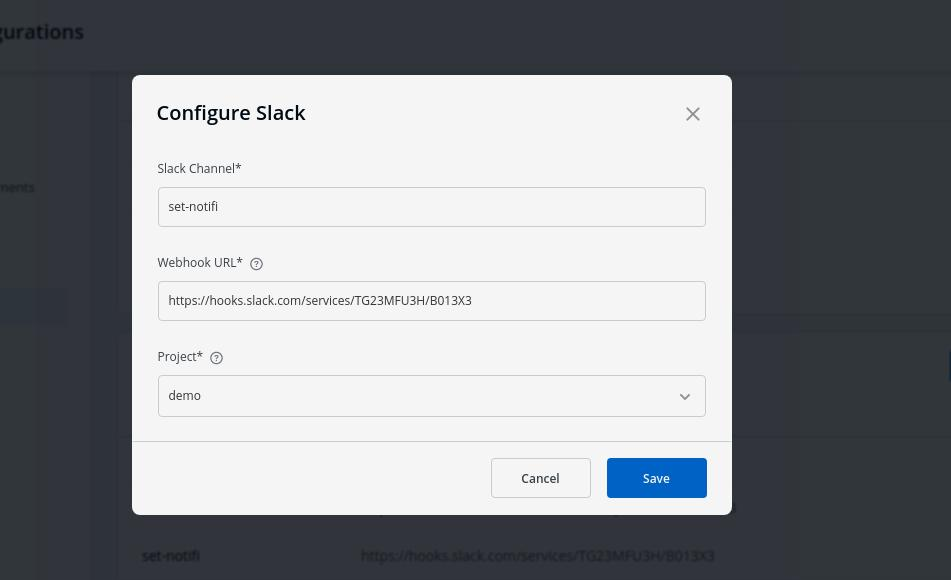
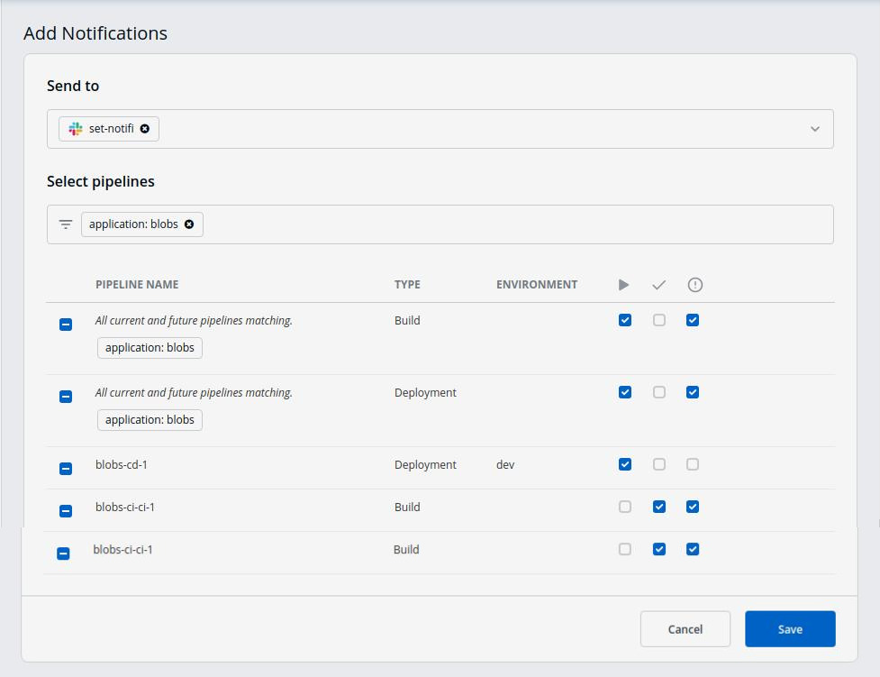

+++
bookCollapseSection = false
title = "Manage Notification"
description = ""
weight = 1
+++

# Notification

This feature helps you manage the notifications for your build and deployment pipelines. You can recieve the notifications on Slack or via e-mail.

Click on Global Configurations-> Notification

 

## **Manage Configuration**

Click on **Configurations** to manage `SES Configurations` or `Slack Configurations`

&nbsp;&nbsp;

&nbsp;&nbsp;

### **Manage SES Configurations**

You can manage the SES configuration to recieve e-mails by entering the valid credentials. Make sure your e-mail is verified by SES. 

&nbsp;&nbsp;

 

Click on `Add` and configure SES.

&nbsp;&nbsp;

&nbsp;&nbsp;

Key | Description
----|----
`Configuation Name` | Name of the SES Configuration 
`Access Key ID` | Valid AWS Access Key ID
`Secret Access Key` | Valid AWS Secret Access Key
`AWS Region` | Select the AWS Region from the drop-down menu 
`E-mail`     | Enter the SES verified e-mail id on which you wish to recieve e-mail notifications

&nbsp;&nbsp;

### **Manage Slack Configurations**

You can manage the Slack configurations to recieve notifications on your preferred Slack channel.

&nbsp;&nbsp;

 

Click on `Add` to add new Slack Channel.

&nbsp;&nbsp;

&nbsp;&nbsp;

Key | Description
----|----
`Slack Channel` | Name of the Slack channel on which you wish to recieve notifications.
`Webhook URL` | Enter the valid [Webhook URL link](https://slack.com/intl/en-gb/help/articles/115005265063-Incoming-webhooks-for-Slack) 
`Project` | Select the project name to control user access

&nbsp;&nbsp;

## **Manage Notifications**

Click on `Add New` to recieve new notification.

&nbsp;&nbsp;

&nbsp;&nbsp;

### **Manage Slack Notifications**

&nbsp;&nbsp;

&nbsp;&nbsp;

***Send To***

First, enter the name of your Slack Channel if you have already configured Slack Channel. 
If you have not yet configured the Slack Channel, Click on [Configure Slack Channel](https://docs.devtron.ai/docs/reference/global-configurations/manage-notification/#manage-slack-configurations)

 

***Select Pipelines***

* Then, to fetch pipelines of an application, project and environment.

   * Choose a filter type(`environment`, `project` or `application`)

   * Then you will see a list of pipelines, you can select any number of pipelines. For each pipeline there are 3 types of events `Trigger`, `Success` and `Failure`. Click on the check boxes for the events, you wish to recieve notifications. 

&nbsp;&nbsp;

 

Click on `Save` after you have configured Slack notifications. 

 

### **Manage SES Notifications**

&nbsp;&nbsp;

&nbsp;&nbsp;

***Send To***

* First, enter the e-mail address/addresses on which you want to send e-mail notifications. Make sure e-mail id's are SES Verified.

If you have not yet configured SES, Click on [Configure SES](https://docs.devtron.ai/docs/reference/global-configurations/manage-notification/#manage-ses-notifications)

 

***Select Pipelines***

* Then, to fetch pipelines of an application, project and environment.

   * Choose a filter type(environment, project or application)

   * Then you will see a list of pipelines, you can select any number of pipelines. For each pipeline there are 3 types of events Trigger, Success and Failure. Click on the check boxes for the events, you wish to recieve notifications. 

&nbsp;&nbsp;

 

Click on `Save` after you have configured the e-mail notification.

